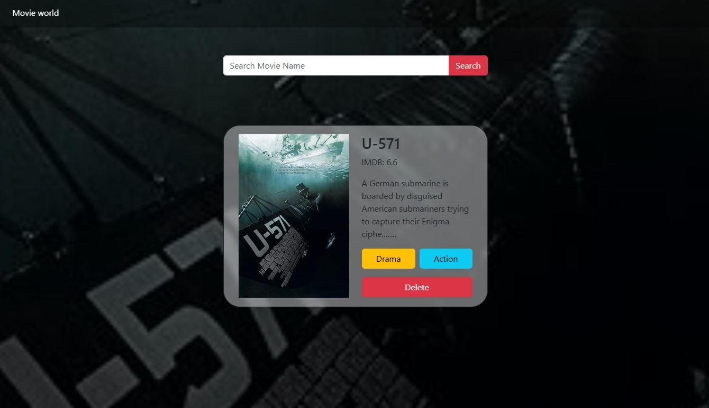
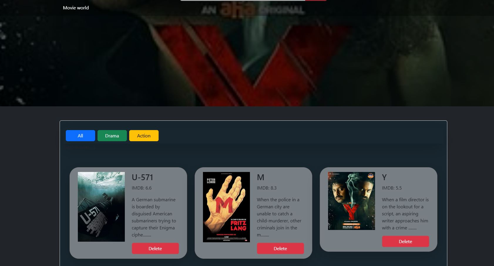

# Movie World

A React application that allows you to discover, search and catagorized movies using OMDB API. Browse random movie, search by title, and build your own watchlist by genre. All saved movies will be stored in local storage so that you wouldn't loose between sessions.

## Table of content

1. [Introduction](#introduction)
2. [Screenshots](#screenshots)
3. [Features](#features)
4. [Techstack](#techstack)
5. [How to Use ](#how-to-use)
6. [Usage](#usage)
7. [Project Structure](#project-structure)
8. [Contact](#contact)

## Introduciton

Movie world applicaition fetches a random movies on load and display it as an interactive card. You can search for any movie by title, catagorize it as a Drama or Action. When it gets addes it will be shown in yor personal display below and save it in local storage to survive pae refreshes.

## Screenshots




## Features

- Random movie loaded on launch via OMDB API
- Search any movie by title
- Dynamic background updates to match the current movie poster
- Categorize movies as Drama or Action — saved to your list
- Filter your list by All, Drama, or Action
- Delete movies from hero or from your saved list
- Movie list persists via local storage
- Responsive design for mobile and desktop
- Smooth card animation on movie load

# Techstack

- React
- JavaScript
- Axios
- Bootstrap 5
- OMDB API
- Local Storage API
- Vite

## How to use

To run this project locally, follow these steps

```
# Clone the repository
git clone https://github.com/bguragain1023-web/Movie-World.git

# Navigate into the project directory
cd Movie-World

# Install dependencies
yarn

# create .env file in the root dirctory and add your OMdb API key:

VITE_APIKey = your_api_key

# Run the development server
yarn dev

```

Get the free API key from omdbapi.com

## Usage

Once the development server is running, open http://localhost:5173 in your browser. You can navigate through the different sections using the navigation bar. The project cards are interactive and provide insights into my recent work.

## Project Structure

src/
├── components/
│ ├── Hero.jsx # Search, random fetch, movie card display
│ ├── Display.jsx # Categorized movie list with filter
│ └── MovieCard.jsx # Reusable card component
├── utils/
│ ├── axios.js # OMDB API fetch logic
│ ├── localStorage.js # Local storage helpers
│ └── random.js # Random character generator for random fetch
└── App.jsx # Global state, list management

## Contact

- Brazesh Gurgain
- Location:Hobart Tasmania
- linkdln: [https://www.linkedin.com/in/brazesh-guragain-32a6661b0/?skipRedirect=true]
- website: brazeshguragain.com
- b.guragain1023@gmail.com
